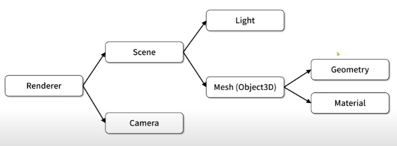
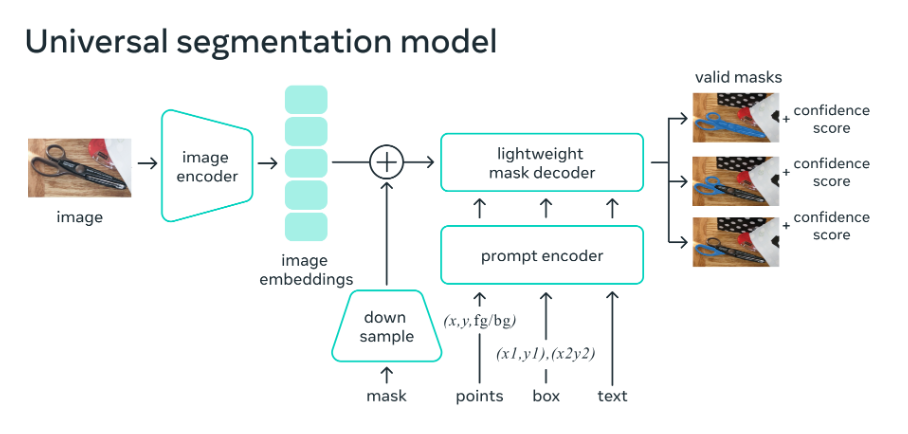

<h2>1.이번학기 컴퓨터그래픽스 수업에서 학습한 내용을 A4용지 1/2 정도로 요약하시오.</h2>

그래픽스 수업에서 기본 배경을 이해하기 위해 크게 Renderer와 Scene, Camera의 관계를 이해하고 Mesh와 Geometry, Material의 관계를 이해하였습니다. 이후 2D그래픽스와 3D그래픽스를 학습하고
컴퓨터그래픽스가 활용되는 응용분야로는 게임,애니메이션,가상현실,데이터 시각화 등이 있다는 것을 학습해 컴퓨터그래픽스라는 학문이 가까이서 활용되고 있어 친숙해 질 수 있었습니다. 
다음으로 P5.js를 활용해 orbitControl()를 활용해 도형을 조각하는 것을 학습하고 Node.js를 사용해 http-server를 실행해 로컬로 서버를 열어 웹 환경에서 학습을 진행해 보았습니다.
여기서 3D그래픽스를 학습할 수 있었습니다. 도형에 이미지를 입히기 위해서는 texture()라는 함수를 사용해 입히는 것을 학습할 수 있었습니다.
WebGL에선 래스터화가 정점의 위치와 색상을 이제 화면에 픽셀로 변화시켜주는 과정이라는 것을 학습하였습니다.
Three.js에선 Scene, Camera, Renderer, Mesh, Light라는 구성요소를 사용해 학습해 보았는데 회전하는 큐브를 렌더링하는 실습 또안 같이 진행해보았습니다.
여기선 Scene을 만들어주기위해서 const scene = new THREE.Scene();을 사용하고 Camera를 만들어주기 위해 const camera = new THREE.PerspectiveCamera();를 사용해주었습니다. 
마찬가지로 Renderer, Mesh, Light도 위와 같은 방법으로 구현해주는 방법을 학습하였습니다.
3D 객체 변환 기법으로 rotation.x ,rotation.y를 사용해 x와y축을 기준으로 회전할 수 있고, position.x, position.y 으로 위치 지정이 가능하고
translateX()를 통해 이동이 가능하다는 것 또한 학습하였습니다.
Three.js는 WebGL 기반 3D그래픽스 구현을 쉽게 만들어주는 라이브러리인데 이것은 다양한 3D효과와 상호작용을 추가할 수 있으며, 창의적인 웹 애플리케이션 개발이 가능하다는 것 또한 학습하였습니다.
쉐이더에 대해 잠깐 설명드리자면 GPU에서 실행되는 작은 프로그램으로서 그래픽을 그리는 방식을 제어합니다.
장점으로 CPU 대신 GPU에서 병렬로 빠르게 실행하기 때문에 성능 측면에서 장점이 존재하고 개발자가 원하는 스타일로 화면을 자유롭게 표현 할 수 있다는 장점 또한 존재합니다.
Vulkan 또한 교수님과 함께 무지게 삼각형 만들기 실습을 기반으로 학습해보았습니다.
그래픽스를 크게 보면 쉬운 수준으로는 Processing/p5.js , raylib, glfw+glad+stb+c언어 등이 존재하고 중간 수준으로는 GLFW+GLAD+GLM+stb+OpenGL (C++), SDL+OpenFL이 존재합니다.
마지막 고급수준(엔진/프레임워크 또는 저수준 API 조합)으로는 OpenGL+Vulkan 연계, Custom 엔진에서의 OpenGL 사용하는 방법이 존재합니다.

다음으로 카메라를 통해 USER의 얼굴을 인식하는 실습을 진행해 보았습니다.
처음에는 이미지를 로컬 폴더에 저장하고 이를 불러와서 얼굴을 인식하는 실습을 진행하였습니다.
SAM(Segment Anything Model)을 학습하였는데 이는 이미지나 영상 속 객체를 자동으로 잘라내는 AI모델입니다. 기존에는 사람이 일일이 수작업으로 진행했던 작업을 SAM을 통해 편하게
진행 할 수 있게 되었습니다.
예시로 그래픽/영상 편집 부분에선 배경제거,객체 강조, 레이어분리가 있고 게임/AR/VR 분야에선 Unity/Unreal에서 실시간 객체 추출, 카메라 피드에서 사람만 분리, 터치 기반 상호작용이 존재합니다.
WebGL/WebGPU 분야에서 SAM 마스크를 알파 마스크로 사용 -> 실시간 마스킹/블렌딩/효과 적용 가능하는 방법이 있습니다.

