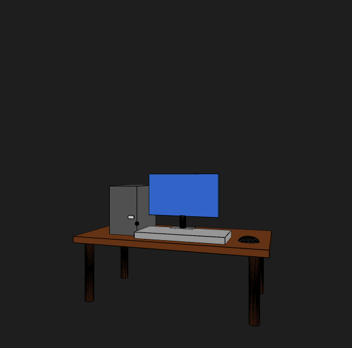
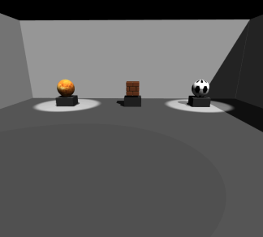

<h2>2. 이번학기 개별과제 및 팀과제의 내용과 내가 기여한 내용을 A4 1/2 정도로 요약하시오.</h2>

저희 팀은 수업 시간에 학습한 내용을 최대한 활용하고자 3D도형을 사용해 수업에 사용하는 데스크톱 환경을 구현해보자는 시나리오를 구성하게 되었습니다.
이 팀 프로젝트에서 저는 조장을 맡아 "이동현" 학생과 함께 프로젝트를 진행하였는데 저 같은 경우에는 아이디어로 파도치는 프로젝트를 진행하자고 하였고 팀원의 경우 지금 실습을 하는 환경 죽 실습실에서
저희가 사용하는 컴퓨터와 책상,본체를 구현하는 아이디어를 냈는데 제가 보았을 때는 팀원의 아이디어가 실용적이라고 생각이 들어 토의를 통해 위와 같이 컴퓨터,본체,책상을 구현하고 이를 회전하도록 구현하였습니다.
push(), pop(), cylinder(), 등등을 활용하여 소스코드를 작성하게 되었습니다. http 서버를 열어 사진과 같이 웹 기반 환경에서 구축하는 것 또한 실습해 보았습니다.

팀과제에서 "나만의 3D 갤러리 전시관 만들기" 프로젝트를 진행했는데
Three.js를 활용해 3D 가상 전시관(Gallery)을 구현하고, 객체 생성, 애니메이션, 조명, 텍스처, 셰이더 효과를 모두 포함한 인터랙티브한 학습형 미니 프로젝트.
저는 여기서 조장을 맡았습니다. 팀원들과 역할을 분담하고 크게 개발자들과 발표자(발표자료 및 발표) 2분야로 나눠 프로젝트를 진행하였습니다.

1주차
팀 구성 및 역할 분담
Three.js 구조 리뷰
전시관 기본 구조 제작 (Scene/Camera/Renderer)
3D 객체 배치 + 조명 설정
2주차
텍스처 입히기 (바닥, 벽, 전시물)
간단한 셰이더 효과 한두 개 추가
카메라 이동/컨트롤 구현
팀원별 작품 발표 및 결과물 마무리

개발자들이 자신이 맡은 파트를 진행하면 그 부분을 깃허브에 업로드하고 따로따로 구현되어있는 기능들을 제가 통합하여 발표자가 소스코드를 보고 이해할 수 있도록 기능마다 주석문을 넣어 주는 작업을 진행하였습니다.
기대 효과로는 기억한 모든 Three.js 개념(객체 생성, 변환, 조명, 텍스처, 셰이더 등) 복습 가능, 짧은 기간에 협업 경험 및 발표 역량 향상 ,결과물을 포트폴리오로 활용 가능하다는 결과를 가져왔습니다.
